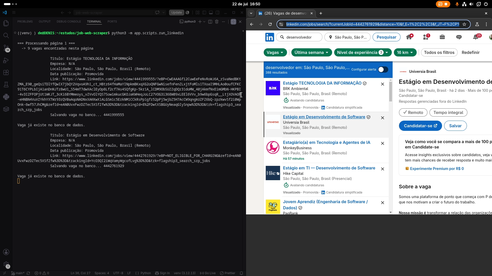
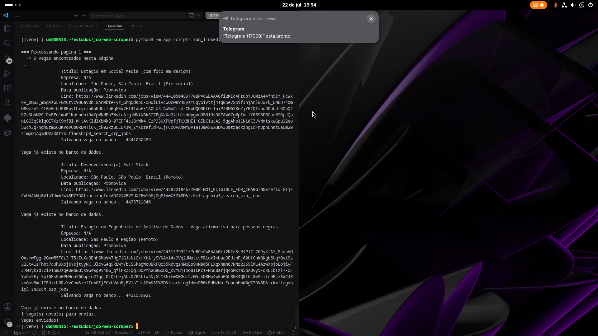
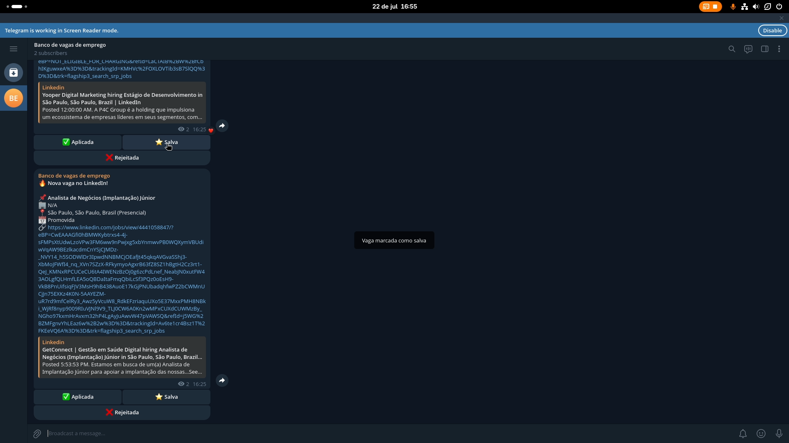

# job web scraper

<!--Badges -->

> Job web scraper é um sistema de busca de vagas de emprego que utiliza web scraping para coletar oportunidades de diferentes fontes.

## 📌 Sobre
Este sistema busca resolver o problema de pesquisar oportunidades de emprego manualmente em diferentes plataformas. Utilizando técnicas de web scraping, automatizando, coletando e centralizando essas vagas.

Ele pode ser Utilizado por qualquer pessoa que busca uma oportunidade profissional. As vagas podem ser filtradas por cargos e outros critérios, tornando a busca eficiente, independente da área de atuação do usuário.

Tem por objetivo, diminuir o tempo gasto pesquisa de vagas, automatizando todo o processo e reunindo as oportunidades em um canal do Telegram, permitindo que o usuário acompanhe novas vagas de qualquer lugar.

O projeto foi criado para solucionar um problema pessoal: o tempo excessivo gasto procurando oportunidades de emprego manualmente em diversas fontes. A partir desse problema, surgiu a ideia de desenvolver um ferramenta que tornasse esse processo rápido, prático e organizado.


## 📷 Demonstração

Iniciando scraper


Enviando notificação ao Telegram


Marcada como Aplicada


Marcada como Salva


<!-- ## 🏗 Arquitetura

--- -->

## ✨ Funcionalidades
- Realizar Login
- Persistir a sessão de login
- Filtrar vagas por palavras-chave
- Buscar vagas em diferentes fontes
- API REST
- Salvar vagas no banco de dados
- Enviar vagas automaticamente para um canal do Telegram
- Botões funcionais de **Rejeitada**, **Aplicada** ou **Salva** diretamente no telegram
- Enviar notificações a cada nova vaga enviada ao Telegram


## 🛠 Tecnologias
- Python - Linguagem principal do projeto
- FastAPI - Desenvolvimento da API REST
- Playwright - Automação do navegador e web scraping
- PostgreSQL - Armazenamento das vagas
- SQLAlchemy - ORM para comunicação com o banco de dados
- Telegram Bot API - Envio de vagas e interação com os usuários no Telegram
- GitHub Actions - Automação da execução do scraper e integração contínua

## 📂 Estrutura do Projeto

```markdown
Projeto
├── app
│   ├── api
│   │   └── webhook.py
│   ├── core
│   │   └── scheduler.py
│   ├── database
│   │   ├── connection.py
│   │   ├── crud
│   │   │   ├── crud_infojobs.py
│   │   │   └── crud_linkedin.py
│   │   └── model.py
│   ├── docs
│   │   ├── imagens
│   │   ├── scheduler.md
│   │   └── videos
│   ├── main.py
│   ├── scrapers
│   │   ├── infojobs
│   │   │   ├── cookies
│   │   │   ├── filtros.py
│   │   │   ├── login.py
│   │   │   └── scraper.py
│   │   └── linkedin
│   │       ├── cookies
│   │       ├── filtros.py
│   │       ├── login.py
│   │       └── scraper.py
│   ├── scripts
│   │   ├── create_database.py
│   │   ├── run_infojobs.py
│   │   └── run_linkedin.py
│   └── services
│       └── telegram.py
├── estrutura_projeto.txt
├── README.md
└── requirements.txt
```

## ⚙ Deploy

- GitHub - Usado para hospedar os Scrapers, usando cron, rodando de hora em hora
- Render - Usado para hospedar a API
- Supabase - Usado para hospedar o banco de dados
*Para uma melhor experiência, contrate um serviço de hospedagem pago!*

## 🚀 Como usar

### 1. Configurar o Telegram

1. Baixe o Telegram em seu smartphone ou utilize a versão Web/Desktop.
2. Crie uma conta ou faça login.
3. Pesquise por **@BotFather** e inicie uma conversa.
4. Execute o comando `/newbot`.
5. Escolha um nome e um **username** para o bot.
6. Ao final, o BotFather fornecerá um **Token de Acesso**. Guarde esse token.
7. Crie um canal no Telegram.
8. Adicione o bot criado como **Administrador** do canal, concedendo permissão para enviar mensagens.
9. Obtenha o **ID do canal** (utilizado pelo sistema para enviar as vagas).

### 1.1 Obter o id do Canal
1. Envie uma mensagem no canal
2. Abra o navegador e acesse: https://api.telegram.org/bot<SEU_TOKEN>/getUpdates
3. Na resposta JSON, procure pelo campo chat id.

### 2. Configurar as variáveis de ambiente

Crie um arquivo `.env` na raiz do projeto e preencha as variáveis conforme o exemplo abaixo:

```env
# Caminho do Banco de dados
DATABASE_URL=

# Telegram
API_TOKEN=
CANAL_ID=

# Cookies de sessão do InfoJobs para login
INFOJOBS_LOG=

# Cookies de sessão do LinkedIn para login 
LINKEDIN_LOG=
```

> Observação 1: Substitua os valores pelas credenciais e identificadores obtidos durante a configuração.

> Observação 2: Para gerar os cookies de sessão do InfoJobs ou LinkedIn, execute o arquivo login.py da respectiva plataforma. O navegador será aberto para que você realize o login manualmente utilizando seu e-mail e senha. Após concluir o login, retorne ao terminal e pressione Enter. O sistema irá gerar automaticamente um arquivo .json contendo os cookies da sessão autenticada.

> Observação 3: Adicione o arquivo .json gerado ao .gitignore para evitar o envio de informações de autenticação ao repositório. Em seguida, informe o caminho desse arquivo nas variáveis INFOJOBS_LOG e LINKEDIN_LOG do arquivo .env.

### 3. Configurar o sistema

Clone o projeto
```markdown

```

Crie o ambiente virtual
```markdown
python -m venv venv
```

Ative <br>

Windowns
```markdown
venv\Scripts\activate
```

Linux
```markdown
source venv/bin/activate
```

Instale as dependências
```bash
pip install -r requirements.txt
```

Crie o banco de dados:

```bash
python -m app.scripts.create_database
```

Inicie a API:

```bash
fastapi dev app.main
```

ou

```bash
uvicorn app.main:app --reload
```

### 4. Executar os scrapers

**InfoJobs**

```bash
python -m app.scripts.run_infojobs
```

**LinkedIn**

```bash
python -m app.scripts.run_linkedin
```

Após a execução, as vagas encontradas serão:

* armazenadas no banco de dados;
* disponibilizadas pela API;
* enviadas automaticamente para o canal do Telegram configurado.

## 📖 Documentação

A documentação completa está em: 
```markdown
docs/
```
Inclui:
- Imagens
- Videos <br>
*A documentação se encontra em desenvolvimento!*

<!-- ## 🤝 Contribuindo -->

## 👨‍💻 Autor

**Denis Goes**
GitHub: https://github.com/DenisGoes

<!-- Portfólio:  -->

## 📄 Licença
*Este projeto está licenciado sob a licença MIT.* 

## Aviso
*Este projeto foi desenvolvido para fins educacionais e de estudo sobre automação e web scraping. O uso da ferramenta deve respeitar os termos de uso e as políticas das plataformas acessadas. O autor não se responsabiliza pelo uso inadequado do software.*

## Agradecimentos

Obrigado por utilizar o Job Web Scraper!

Este projeto foi desenvolvido com o objetivo de facilitar a busca por oportunidades de emprego e, ao mesmo tempo, servir como um projeto de estudo e evolução contínua.

Toda sugestão, relato de problemas, ideias de melhorias ou contribuição é muito bem-vinda. Se este projeto foi útil para você, considere deixar uma ⭐ no repositório para apoiar seu desenvolvimento.